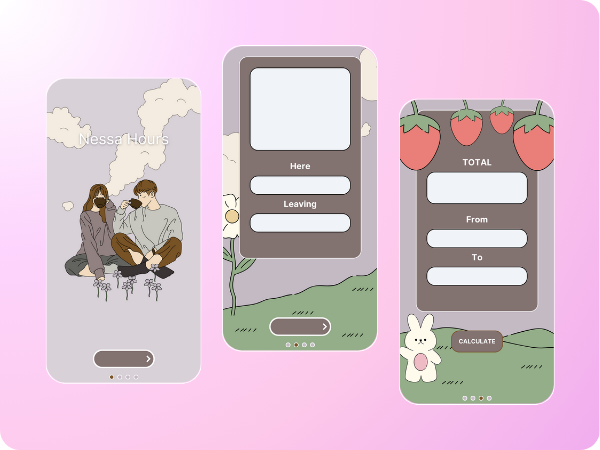

# NessaHours

NessaHours is a user-friendly work hours tracking app designed to help individuals log, calculate, and manage their work hours efficiently. Ideal for freelancers, contractors, or anyone needing a simple way to keep track of hours worked, NessaHours provides an intuitive, customizable experience right on your iPhone.

 <!-- Replace with actual path once image is added -->

## Table of Contents
- [Features](#features)
- [Screenshots](#screenshots)
- [Technologies Used](#technologies-used)
- [Getting Started](#getting-started)
- [Usage](#usage)
- [Future Enhancements](#future-enhancements)

---

## Features
- **Work Hours Logging**: Log daily work entries including start time, end time, date, and office location.
- **Customizable Interface**: Tailor the layout with various UI elements to suit personal preferences.
- **Range-Based Calculations**: Calculate total hours worked over a specific date range (e.g., weekly or biweekly).
- **Local Data Storage**: Store entries locally using CoreData, providing offline access and ensuring data privacy.
- **User-Friendly Interface**: Clear navigation and simple design for all levels of tech users.

## Screenshots
*Include screenshots of your app to show its UI and functionality.*
- Home Screen
- Add Work Entry Screen
- Total Hours Calculation Screen


## Technologies Used
- **SwiftUI & UIKit**: For modern and responsive UI design with added customization.
- **CoreData**: Provides efficient data storage, retrieval, and local data management.
- **Swift Drag & Drop** (planned): Allows users to personalize the app layout further by dragging and placing elements.

## Getting Started
### Prerequisites
- **Xcode** (version 12 or later)
- An **iOS device** or **simulator** running iOS 14+

### Installation
1. **Clone the repository**:
   ```bash
   git clone https://github.com/your-username/NessaHours.git
