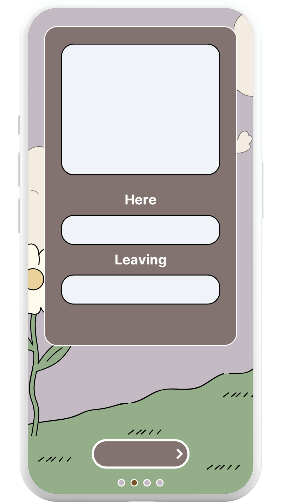
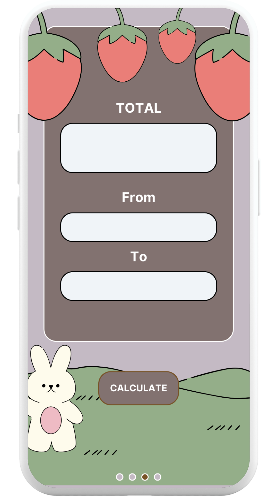

# NessaHours

NessaHours is a user-friendly work hours tracking app designed to help individuals log, calculate, and manage their work hours efficiently. Originally developed to satisfy the needs of a single user, this app is a **prototype with a larger vision**: to become a fully customizable work hours tracker where each user can tailor the experience to fit their unique needs. 

Imagine a work tracking app where **you** decide on the design—background images, button colors, page layout, and more—directly within the app itself. NessaHours aims to make this vision a reality.


## Table of Contents
- [Features](#features)
- [Screenshots](#screenshots)
- [Technologies Used](#technologies-used)
- [Getting Started](#getting-started)
- [Usage](#usage)
- [Future Enhancements](#future-enhancements)

---

## Features
- **Work Hours Logging**: Log daily work entries, including start time, end time, date, and office location.
- **Customizable Interface**: The prototype allows for a simple layout tailored to one user’s preferences. The ultimate goal is to let users customize all UI elements—backgrounds, colors, and more.
- **Range-Based Calculations**: Calculate total hours worked over any specified date range (e.g., weekly or biweekly).
- **Local Data Storage**: All data is stored locally using CoreData, ensuring offline access and user privacy.
- **User-Friendly Interface**: Clear navigation and simple design suitable for all tech experience levels.

## Screenshots
Here are some screenshots showcasing the prototype’s interface:






## Technologies Used
- **SwiftUI & UIKit**: For creating a responsive, modern UI with extensive customization options.
- **CoreData**: Enables efficient data storage and retrieval, allowing users to work offline.
- **Swift Drag & Drop** (planned): Future updates will include enhanced drag-and-drop functionality to let users design their own layouts.

## Getting Started
### Prerequisites
- **Xcode** (version 12 or later)
- An **iOS device** or **simulator** running iOS 14+

### Installation
1. **Clone the repository**:
   ```bash
   git clone https://github.com/your-username/NessaHours.git
